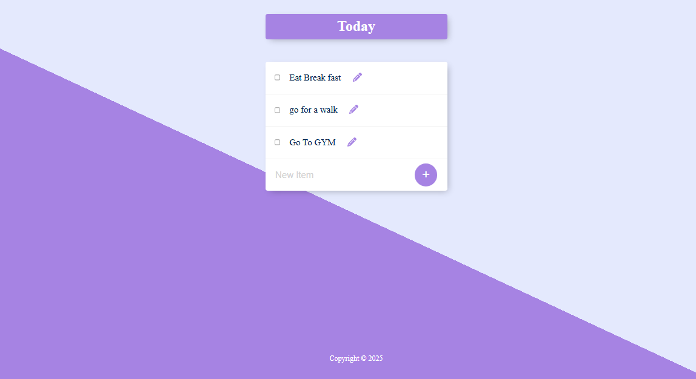

# Permalist App

Permalist is a dynamic web application that allows users to easily manage a personalized list of items. It provides an intuitive interface to add, update, and delete items, ensuring a seamless user experience.

# Preview



## Features

- **Add Items**: Add new items to your personal list effortlessly.
- **Delete Items**: Remove unwanted items with a single click.
- **Simple Interface**: User-friendly design for smooth interaction.

## Tech Stack

- **Backend**: Node.js, Express.js
- **Frontend**: EJS, HTML, CSS
- **Database**: PostgreSQL for secure and efficient data storage

## Setup Instructions

To set up the app locally, follow the steps below:

1. **Clone the repository**:
   ```bash
   git clone <repository-url>
   cd permalist-app
